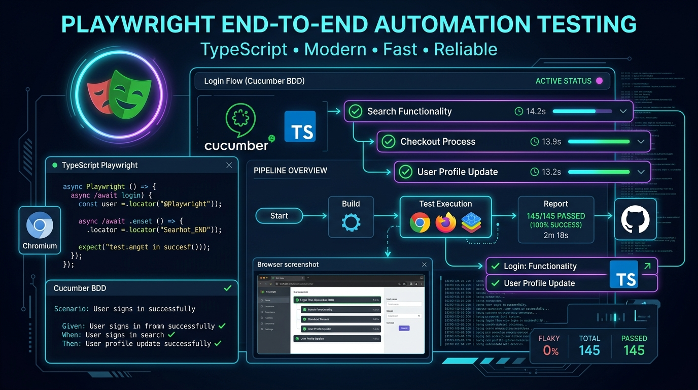

# 🎭 Playwright TypeScript - Sauce Demo E2E Test Suite



Enterprise-grade End-to-End (E2E) automation test suite built with **Playwright**, **TypeScript**, and **Cucumber Gherkin BDD**, targeting the [Sauce Demo (Swag Labs)](https://www.saucedemo.com/) e-commerce web application.

---

## 🌟 Key Highlights & Design Patterns

- **Page Object Model (POM) + Component Architecture**: Decouples UI structure and locators from test logic. Modular component structure for shared elements (e.g. Header, Navigation menu).
- **Cucumber Gherkin BDD Support (`playwright-bdd`)**: Supports human-readable `.feature` files with step definitions while retaining all native Playwright features (Trace Viewer, UI Mode, Parallelism).
- **Custom Playwright Fixtures (`test.extend`)**: Dependency injection for clean, readable tests without manual `new PageObject(page)` instantiations.
- **Web-First Assertions & Semantic Locators**: Built using Playwright's auto-retrying locators (`getByRole`, `locator('[data-test="..."]')`) and assertions (`expect(locator).toHaveText(...)`).
- **Dynamic Price & Math Assertions**: Calculates item subtotals and verifies taxation (`subtotal + tax === total`) using financial precision rounding.
- **Strict TypeScript & Type Safety**: Strongly typed interfaces for customer information, product models, and order summaries.
- **Cross-Browser & CI/CD Ready**: Multi-browser execution (Chromium, Firefox, WebKit), trace viewer on retry, failure screenshots/videos, and GitHub Actions workflow.

---

## 🏗️ Project Architecture

```
playwright-ts-test/
├── .github/
│   └── workflows/
│       └── playwright.yml         # GitHub Actions CI pipeline
├── docs/
│   └── assets/
│       └── playwright-e2e-banner.jpg # Project banner asset
├── features/                      # 🥒 Cucumber Gherkin Feature Files
│   ├── cart-persistence.feature   # Cart operations & state preservation
│   ├── checkout-validation.feature# Form validation & required field errors
│   ├── checkout.feature           # Single & multi-product checkout journeys
│   └── login.feature              # Authentication & access control
├── src/
│   ├── components/
│   │   └── header.component.ts    # Shared header, cart badge & menu drawer
│   ├── constants/
│   │   ├── products.constant.ts   # Product catalog fixtures
│   │   └── users.constant.ts      # Test credentials & standard error messages
│   ├── fixtures/
│   │   └── base.fixture.ts        # Custom fixture injecting pre-instantiated POMs
│   ├── pages/
│   │   ├── base.page.ts           # Abstract base page with common helpers
│   │   ├── cart.page.ts           # Cart review, item removal & checkout trigger
│   │   ├── checkout-complete.page.ts # Confirmation & dispatch verification
│   │   ├── checkout-step-one.page.ts # Customer shipping info form
│   │   ├── checkout-step-two.page.ts # Order overview, tax & total calculation
│   │   ├── inventory.page.ts      # Product listing, sorting & cart actions
│   │   └── login.page.ts          # Authentication interactions & error banners
│   ├── steps/                     # 🪜 Cucumber Step Definitions (reusing POMs)
│   │   ├── cart.steps.ts
│   │   ├── checkout.steps.ts
│   │   ├── inventory.steps.ts
│   │   └── login.steps.ts
│   ├── types/
│   │   └── checkout.types.ts      # TypeScript interfaces
│   └── utils/
│       └── price.util.ts          # Currency parser & financial rounding helpers
├── .gitignore
├── package.json
├── playwright.config.ts           # BDD + Multi-browser configuration
├── README.md
└── tsconfig.json
```

---

## 🧪 BDD Feature Scenarios

### 1. End-to-End Checkout (`features/checkout.feature`)
- **Single-Product E2E Checkout**:
  1. Login with `standard_user`.
  2. Add product (`Sauce Labs Backpack`) to cart & verify badge counter.
  3. Review cart items, quantity (`1`), and price.
  4. Fill shipping information (`First Name`, `Last Name`, `Postal Code`).
  5. Validate payment method, delivery info, and verify mathematical integrity: `Subtotal + Tax === Total`.
  6. Place order, assert `"Thank you for your order!"`, empty cart badge.
- **Multi-Item Checkout**:
  - Adds multiple items simultaneously, verifies cumulative subtotal against catalog prices and tax calculation.

### 2. Authentication & Access Control (`features/login.feature`)
- Happy path login for `standard_user`.
- Locked-out account validation (`locked_out_user`) with exact error banner assertion.
- Invalid username/password error validation.
- Blank username required error validation.
- User logout flow via hamburger sidebar menu.

### 3. Checkout Form Validations (`features/checkout-validation.feature`)
- Validates missing First Name, Last Name, and Postal Code required field errors.

### 4. Cart Operations & State Persistence (`features/cart-persistence.feature`)
- Item removal directly from the cart page.
- Cart state preservation when clicking "Continue Shopping" and adding additional items.

---

## 🚀 Quick Start

### Prerequisites
- [Node.js](https://nodejs.org/) (version 18 or higher)
- npm / yarn / pnpm

### Installation
```bash
# 1. Install dependencies
npm install

# 2. Install Playwright browser binaries
npx playwright install
```

### Running Tests

```bash
# Run all tests headlessly across configured browsers (auto-cleans previous reports)
npm test

# Clean test reports and generated artifacts manually
npm run clean

# Run tests with interactive UI mode (recommended for debugging)
npm run test:ui

# Run tests in headed browser mode
npm run test:headed

# Run tests on specific browser
npm run test:chromium
npm run test:firefox
npm run test:webkit

# Check TypeScript types
npm run typecheck
```

### Viewing Test Reports & Traces
```bash
# Open the latest HTML test report
npm run test:report
```

---

## ⚙️ Continuous Integration (CI)

A GitHub Actions workflow is preconfigured in [`.github/workflows/playwright.yml`](.github/workflows/playwright.yml). It automatically runs on push and PR to `main`, executing tests across browsers and uploading HTML reports as build artifacts.
